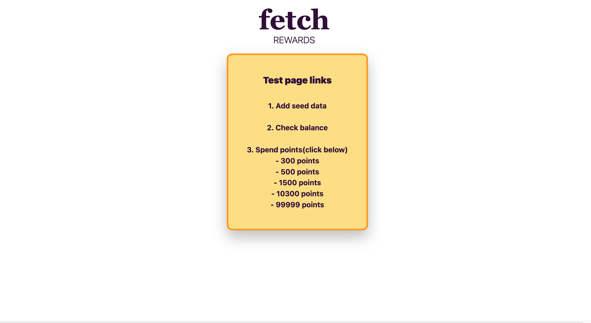

# FR_Backend_Exercise

Express,MongoDB were used for this assignment. 
liqudJS was used for very light and quick front-end work.

## Dependencies
install =>
- npm init
- npm install express mongoose method-override liquid-express-views
- npm i nodemon

to start =>
- nodemon start

to test =>
Click the links to test and don't forget to add seed data first.

## Screenshots

To start a test, please open locahost.
=> http://localhost:3000/

please click the links.
1. adding seed data
2. check total balance and remained points per payer.
3. spend points. If you want to change the amount of pts, please change the param.
   - for example,
   - spend 300 : http://localhost:3000/transaction/spend/300)
   - spend 1500 : http://localhost:3000/transaction/spend/1500)
   - spend 99999 : http://localhost:3000/transaction/spend/99999)

## Technologies used
- express 
- MongoDB
- Javascript 
- liquid JS 
- Tailwind 